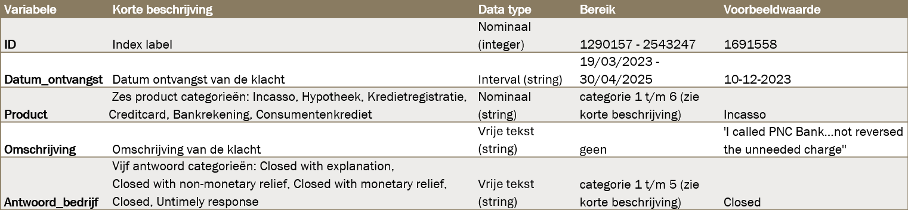

# Dataproject: Casus Klachteninstituut Financiële Dienstverlening

Dit project is uitgevoerd voor het Klachteninstituut Financiële Dienstverlening (KFID) in het kader van het vak Dataproject 1.  
Door aankomende Europese regelgeving verwacht KFID een sterke toename van het aantal klachten.

In dit project is onderzocht of klachtomschrijvingen automatisch kunnen worden geclassificeerd naar productsectoren, zodat KFID deze toename kan opvangen.

## Dataset
De dataset `klachten.csv`, die is ontvangen van de opdrachtgever, bevat 14.887 rijen en 5 kolommen en is volledig geanonimiseerd.  
Deze dataset wordt gebruikt voor de ontwikkeling van een automatisch tekstclassificatiemodel.

### Data Dictionary

## Bestandstructuur
In de map `afbeeldingen` staan de confusion matrices van alle getrainde modellen en de Data Dictionary. 
De map `data` bevat alle CSV-bestanden die binnen dit project zijn gebruikt of gegenereerd.

In `01_EDA.ipynb` wordt de Exploratory Data Analysis uitgevoerd.  
In `02_TextExploratie_Woordanalyse.ipynb` wordt een woordenanalyse uitgevoerd.  
In de notebooks `03` t/m `07` worden verschillende machine learning modellen getraind en geëvalueerd.

## Python-modules
Binnen het project zijn twee Python-modules aangemaakt:

- `helpfuncties.py`  
  Bevat functies voor het inladen van de dataset en het ophalen van tokens, zoals `load_dataset`, `get_all_tokens` en `get_tokens_for_product`.

- `preprocessing.py`  
  Bevat functies voor tekstpreprocessing met SpaCy, waaronder opschoning, tokenization en lemmatization.

## Environment
- Python 3.9.19
- Besturingssysteem: Windows
- Packageversies: zie `requirements.txt`